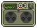
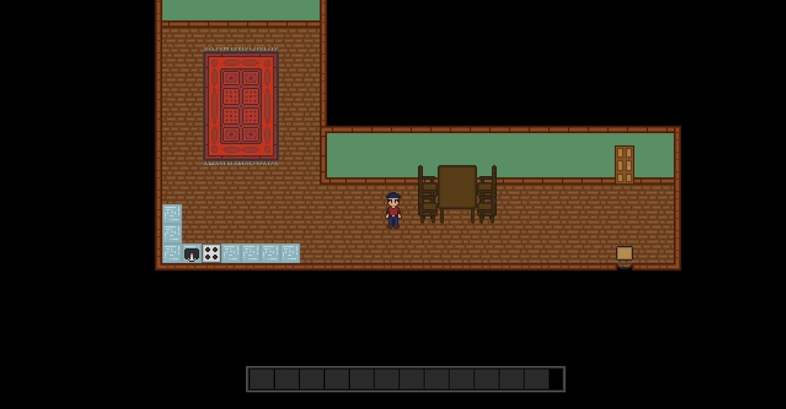
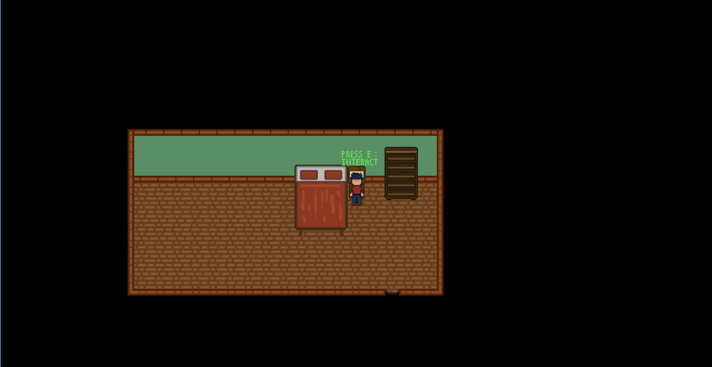
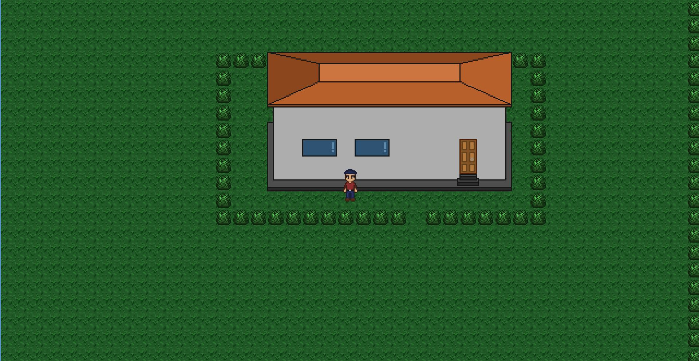

# 2DGame

2D game is made by me, with the help of the playlist ["How to make a 2D game in Java"](https://www.youtube.com/playlist?list=PL_QPQmz5C6WUF-pOQDsbsKbaBZqXj4qSq) by youtuber RyiSnow.\
Pixelart: [piskel.com](https://www.piskelapp.com/)\
Map editor : [Tiled](https://www.mapeditor.org/)

.png)

.png)
.png)

## TODO
### High priority
~~Set to appropriate values to maxWorldRow and maxWorldCol after loading map file in constructor~~\
~~objects~~\
~~collision~~\
~~object collision~~\
~~object interaction~~\
~~interaction popup~~\
~~object permanence (exiting and entering new areas)~~\
~~gradle~~\
~~render object first if player is behind object~~\
~~only rendering objects that are on screen~~\
~~inventory~~
HUD and UI\
table interaction (adding and removing objects)\
placing and removing objects

### Low priority
add second "player walking sideways" sprite\
house sprite (add more details)\
objects for house and garage\
Implement JSON map files for Tiled compatibility\
new textures and tiles

### Bugs
Player sometimes dissapears when clipping objects\
Player can get stuck when placing objects

### Screenshots

